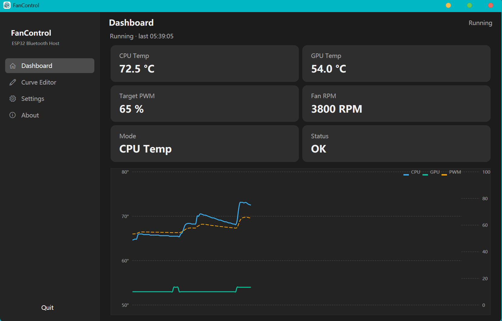
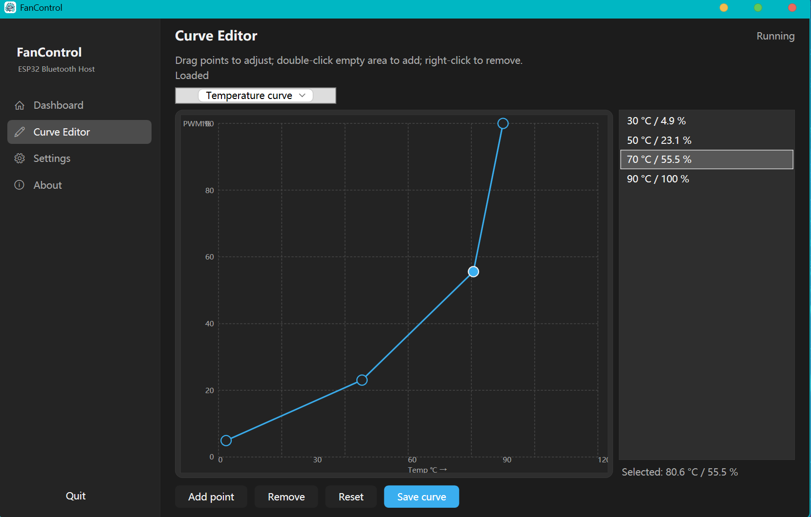
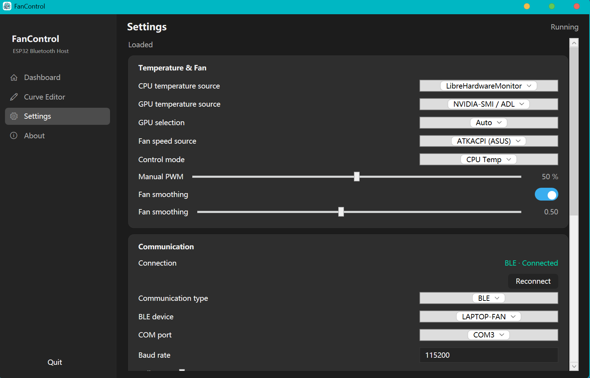
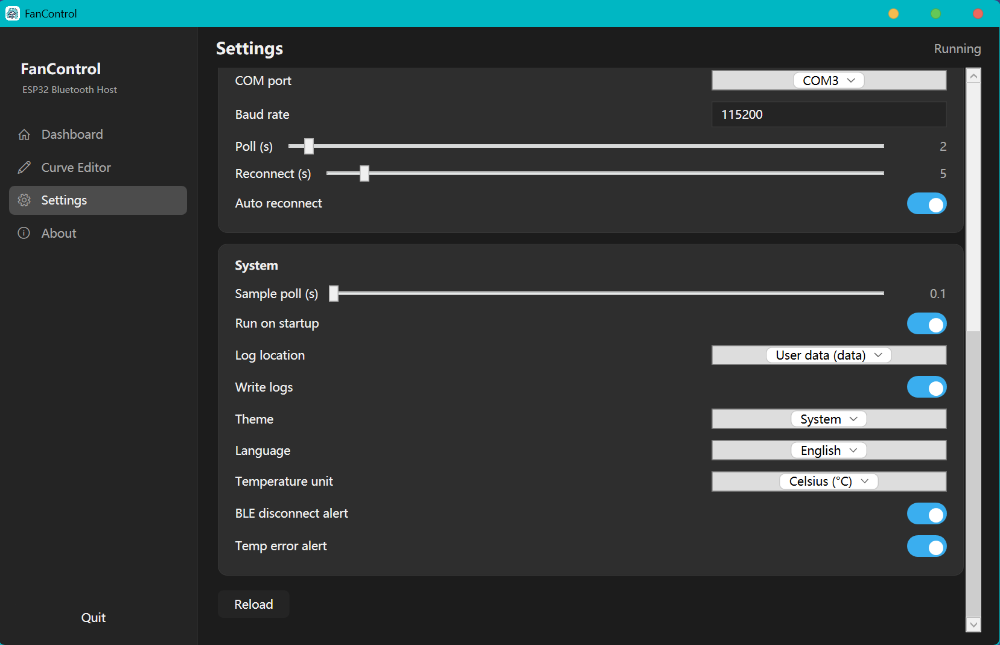

# FanControl

[中文](README.md) | **English**

> FanControl is a companion host app for the open-source hardware by Bilibili creator [垃圾研究社](https://www.bilibili.com/video/BV1Lr421M7u2/). A matching firmware and host app were rewritten for that hardware, forming a complete laptop fan control solution.

  

**Host repo**: [anlerways/Bluetooth-FanControl](https://github.com/anlerways/Bluetooth-FanControl)
**Firmware repo**: [anlerways/ESP32-LaptopFan](https://github.com/anlerways/ESP32-LaptopFan)

## Downloads

- **GitHub Releases**: <https://github.com/anlerways/Bluetooth-FanControl/releases>
- Two forms: **installer** (with setup wizard, shortcuts, uninstaller) and **portable zip** (extract and run);
- Each form comes in two flavors: **self-contained .NET runtime** (no runtime install needed) and **requires .NET 8** (smaller size);
- If antivirus flags the build, add it to the whitelist or disable the AV temporarily; if you don't trust the binaries, clone the repo and build it yourself.

## Screenshots

| Dashboard | Curve editor |
| --- | --- |
|  |  |

| Settings | Settings |
| --- | --- |
|  |  |

## Overview

A full remake built on top of the 垃圾研究社 open-source hardware:

- **Host app**: WinUI 3 desktop app, adding auto-reconnect, auto-start, a control dashboard, more flexible temperature sources, and adjustable temperature-fan curves;

## Features

### Host app

- **Multiple temperature sources**: LibreHardwareMonitor / ASUS ATKACPI / WMI / AIDA64 / NVIDIA-SMI / ADL;
- **Independent CPU / GPU sources** — multi-GPU users can freely choose which GPU to read;
- **Adjustable temperature-fan curves**: 5 control modes (manual / CPU temp / GPU temp / mixed max / mixed average / target RPM), editable temperature and RPM curves, with fan-curve smoothing;
- **Auto-reconnect**: BLE / COM dual channels; automatically retries reconnection on disconnect, with manual reconnect support;
- **Auto-start**: starts quietly in the tray at logon and connects over Bluetooth directly;
- **Control dashboard**: live temperature / PWM / RPM tiles plus custom trend charts (CPU/GPU/PWM);
- **Tray resident**: tray temperature preview, disconnect/error notifications, close-to-tray.

## Architecture

Single-process design: the UI (WinUI 3) and background monitoring run in the same process; the tray runs on its own STA thread; resources are released together on exit.

```text
FanControl.slnx
├── FanControl.Shared/    # Shared contracts: enums / models (config, data packets)
├── FanControl.Service/   # Library: sampling loop, hardware sources, communication, config, tray
├── FanControl.UI/        # WinUI 3 main app
├── FanControl.Installer/ # Inno Setup installer script
├── tests/FanControl.Tests
└── docs/                 # Architecture & protocol docs
```

Sampling chain: `temperature source (independent CPU/GPU) → curve lookup by mode → PWM smoothing → send over BLE/COM → OLED display`.

## Environment

### Host app

- Windows 10/11 x64;
- .NET 8 SDK (8.0.423+) — only needed to compile the source;
- Visual Studio 2026 (WinUI 3 / Windows App SDK workload) — only needed to build the main app;
- Inno Setup 6 (to build installers).

## Build

Prerequisites: .NET 8 SDK (8.0.423+), Visual Studio 2026 (WinUI 3 workload).

```powershell
# Libraries & tests
dotnet build FanControl.Shared
dotnet build FanControl.Service
dotnet test tests/FanControl.Tests

# Main app (WinUI 3, unpackaged, x64; run inside the VS2026 Developer Command Prompt)
msbuild FanControl.UI\FanControl.UI.csproj /restore /p:Configuration=Debug /p:Platform=x64

# Publish a self-contained single exe (no .NET install needed)
msbuild FanControl.UI\FanControl.UI.csproj /restore /t:Publish /p:Configuration=Release /p:Platform=x64 /p:RuntimeIdentifier=win-x64 /p:WindowsAppSDKSelfContained=true /p:PublishDir=artifacts\exe\FanControl
```

## Run

Run [artifacts\exe\FanControl\FanControl.exe](artifacts/exe/FanControl/FanControl.exe), or use the installer / portable zip from a release:

- Main window: dashboard (live temperatures/trend), settings, curve editor;
- Tray: open UI / auto-start / exit; closing the main window minimizes to tray while monitoring continues;
- Manual launch requests administrator rights (hardware sensors); auto-start runs silently with highest privileges via Task Scheduler.

> The Service is a plain library running with user-level privileges — no extra service install needed.

## Temperature sources

| Source | Description |
| --- | --- |
| LibreHardwareMonitor | Default, real hardware sensors (CPU Package/Tctl/Tdie, GPU temp, fan RPM) |
| ATKACPI | ASUS laptops only (reference: G-Helper) |
| WMI | MSAcpi_ThermalZoneTemperature thermal zones |
| AIDA64 | Registry SensorValues (requires “Allow monitoring data to registry” in AIDA64) |
| NVIDIA-SMI / ADL | GPU-only chain: NVIDIA official tool → AMD driver library |

## Protocol

One ASCII line per frame, terminated with `\r\n`:

- Host → firmware: `PWM:<0-100>`, `TIME:yyyy/MM/dd HH:mm:ss`, `TEMP:<cpu>[,<gpu>]`;
- Firmware → host: `READY` (handshake), `STATUS:...` (query reply).

## References & open-source hardware

| Project | Description | Link |
| --- | --- | --- |
| 垃圾研究社 | Adapted open-source hardware solution | <https://www.bilibili.com/video/BV1Lr421M7u2/> |
| G-Helper | ASUS device control reference | <https://github.com/seerge/g-helper> |
| LibreHardwareMonitor | Hardware monitoring library | <https://github.com/LibreHardwareMonitor/LibreHardwareMonitor> |

## Disclaimer

Fan control affects hardware cooling; adjust curves carefully. Firmware/host are provided as-is; use at your own risk.
If antivirus flags the build, add it to the whitelist or disable the AV; if you don't trust the binaries, clone the repo and build it yourself.
